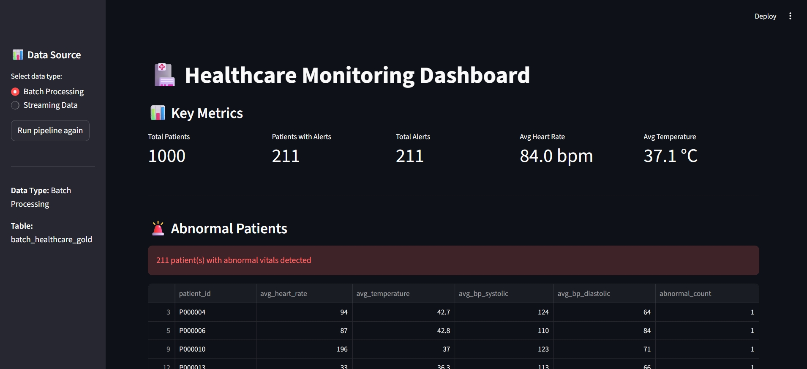

# 🏥 HealthSync Data Pipeline

A production-style healthcare data engineering platform designed to support a patient diagnosis system by ensuring clean, reliable, and analytics-ready data.

---

## 🎯 Overview

This project was developed as an extension of a patient diagnosis system to improve data quality, organization, and reliability for better clinical analysis and decision support.

It processes healthcare data from multiple sources, applies validation rules, detects abnormal patient conditions, and transforms raw data into structured insights through a scalable pipeline.

---

## 🚀 Key Features

* 🧱 Medallion Architecture (Bronze → Silver → Gold)
* 🔄 Batch & Simulated Streaming Pipelines
* 🧪 Data Quality Checks (nulls, duplicates, schema)
* 🚨 Abnormal Patient Detection (vital thresholds)
* 📊 Interactive Dashboard (Streamlit)
* 📈 Synthetic Data Generation (1000–10000+ records)
* ⚙️ CLI-based execution (production-style)
* 🧪 Unit Testing (pytest)
* ☁️ Cloud-ready design (Azure mapping)

---

## 🧭 Architecture

```
CSV / Generator → Bronze → Silver → Gold → SQLite → Dashboard
```

| Layer  | Description                      |
| ------ | -------------------------------- |
| Bronze | Raw healthcare data              |
| Silver | Cleaned and validated data       |
| Gold   | Aggregated, analytics-ready data |

---

## 📸 Dashboard Preview





---

## 🗂️ Project Structure

```
src/
 ├── ingestion/        # Batch & streaming ingestion
 ├── processing/       # Transformations & validations
 ├── storage/          # Database loading
 └── utils/            # Config & logging
tests/                 # Unit tests
data/                  # Data layers (Bronze, Silver, Gold)
dashboard/             # Streamlit app
run.py                 # CLI entry point
```

---

## ⚙️ Tech Stack

| Category        | Technology     |
| --------------- | -------------- |
| Language        | Python         |
| Data Processing | Pandas         |
| Database        | SQLite         |
| Visualization   | Streamlit      |
| Charts          | Matplotlib     |
| Testing         | pytest         |
| CI/CD           | GitHub Actions |

---

## ▶️ Quick Start

### Install dependencies

```bash
pip install -r requirements.txt
```

---

## 📊 Generate Data (Optional)

```bash
python run.py generate-data --records 5000
```

---

## 🔄 Run Batch Pipeline

```bash
python run.py batch-ingest
python run.py batch-process
python run.py load-db --type batch
```

---

## ⚡ Run Streaming Pipeline

```bash
python run.py stream-simulate
python run.py stream-process
python run.py load-db --type streaming
```

---

## 📊 Run Dashboard

```bash
streamlit run dashboard/app.py
```

Open in browser:
👉 http://localhost:8501

---

## 🧠 Healthcare Validations

| Metric      | Normal Range |
| ----------- | ------------ |
| Heart Rate  | 40–180 bpm   |
| Temperature | 35–42 °C     |

---

## 🗄️ Database

Database file:

```
data/healthcare_gold.db
```

Tables:

* `batch_healthcare_gold`
* `streaming_healthcare_gold`

---

## 📊 Results

* Processed 1000+ patient records
* Detected abnormal patient conditions
* Generated structured datasets for analytics
* Built interactive visualization dashboard

---

## ☁️ Future Enhancements (Azure Mapping)

| Current          | Azure Equivalent           |
| ---------------- | -------------------------- |
| Pandas           | Azure Databricks (PySpark) |
| CSV              | Azure Data Lake            |
| SQLite           | Azure SQL Database         |
| Python Streaming | Azure Event Hub            |
| CLI Scripts      | Azure Data Factory         |

---

## 🏆 Key Takeaways

* Built a real-world data pipeline
* Applied healthcare domain validation
* Designed scalable architecture
* Integrated backend + visualization

---

## 👨‍💻 Author

Developed as a data engineering project to demonstrate real-world pipeline design, data processing, and system scalability.
